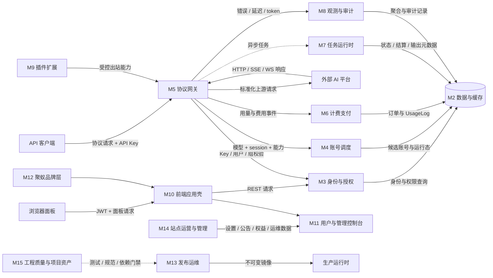

# 06 系统架构与模块划分

## 模块表

| 模块 | 职责 | 依赖 |
|---|---|---|
| M1 | 运行时、配置与安装：进程入口、环境配置、首次 setup、Wire 组装、HTTP 生命周期和嵌入前端 | 无 |
| M2 | 数据模型与基础设施：Ent schema、PostgreSQL 迁移、repository、Redis/S3/外部 client adapters | M1 |
| M3 | 身份、授权与安全：密码/OAuth/Passkey/2FA/JWT、API Key、ACL、限流、step-up 与审计边界 | M1、M2 |
| M4 | 账号、分组与调度：账号凭据、平台分组、模型路由、sticky、并发、配额和可调度资格 | M2、M3 |
| M5 | 协议网关与上游适配：入站路由、协议转换、能力门控、HTTP/WS/SSE 转发、failover 与取消传播 | M1、M3、M4 |
| M6 | 用量、订阅与支付：UsageLog、余额/订阅窗口、计价、订单、provider webhook、履约和退款 | M2、M3、M4 |
| M7 | 异步媒体与任务运行时：异步/批量图片、队列、worker、结算、恢复、输出存储与清理 | M2、M4、M5、M6 |
| M8 | 观测、频道监控与 Prompt Audit：Ops 指标/日志/告警、监控 runner、内容安全策略与审计事件 | M2、M3、M5 |
| M9 | 插件与扩展：manifest/gRPC 契约、包安装、兼容检查、进程 reconcile、灰度路由和 UI bridge | M1、M2、M5 |
| M10 | 前端应用壳：API client、token refresh、Pinia stores、Router guards、layout、设置注入与懒加载 | M1、M3 |
| M11 | 用户与管理控制台：用户 Keys/Usage/Payment/Profile 和管理员 Accounts/Groups/Ops/Settings/Plugins | M3、M4、M5、M6、M7、M8、M9、M10、M14 |
| M12 | 聚蚁品牌层：品牌首页、主题字体、蚁群动效、仪表盘增强、ext 外链和禁自更新边界 | M3、M10、M11 |
| M13 | 构建、发布与生产运维：上游 release 同步、私有镜像、隔离 smoke、备份、切换和 rollback | M1、M2、M5、M10、M12、M15 |
| M14 | 站点运营与管理能力：公共设置/模型广场、公告、渠道/代理、兑换/优惠/分销、备份/数据管理和管理 CLI | M2、M3、M4、M6、M8 |
| M15 | 工程质量与项目资产：全仓测试、fixtures、依赖审计、OpenSpec/文档、开发工具、资源素材和生成物一致性 | M1、M2、M5、M8、M10、M14 |

## 数据流

## 分层约束

- route/middleware 决定请求能否进入；handler 编排单次用例；service 实现业务与上游协议；repository 隔离存储和外部设施。
- Gateway 可以写 Usage/Ops 事件，但观测失败不能无条件改变协议结果；只有明确的安全阻断策略可 fail closed。
- 前端功能开关只是体验层，后端 route/handler 必须保留最终授权与 404/403 兜底。
- 聚蚁层不能复制整个上游模块；优先以新文件和小插入维持 51 文件净差异边界。
- 第 21 节覆盖矩阵为每个 tracked file 指定一个主要维护模块；跨模块文件仍可在任务代码位置中被多个模块引用。
- 测试、fixtures、生成代码、OpenSpec、管理技能和资源文件也是可维护资产，不能因为不在运行时热路径就排除在知识库之外。
