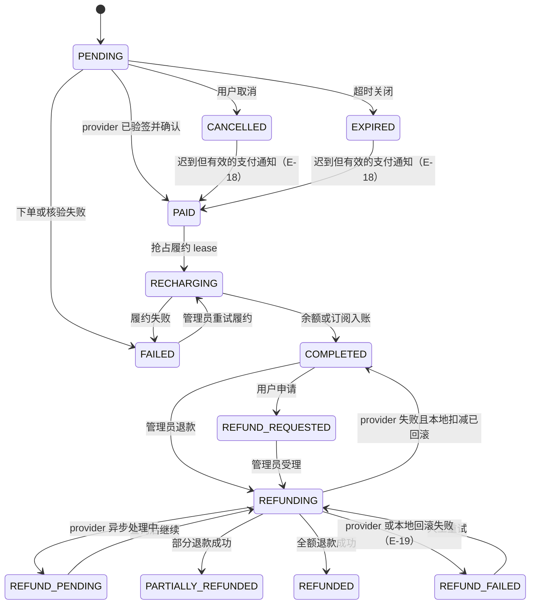

# 07 数据模型

## 数据存储边界

PostgreSQL 是业务事实来源，Ent schema 定义实体和索引，`backend/migrations/` 承担跨版本演进。Redis 保存可重建的鉴权/调度缓存、限流、并发槽、队列、锁和短期会话；S3/本地存储承载图片输出、备份或插件包等大对象。缓存不可成为用户余额、订单或订阅状态的唯一事实来源。

## 核心实体关系

```mermaid
erDiagram
    USER ||--o{ API_KEY : owns
    GROUP ||--o{ API_KEY : assigns
    USER ||--o{ USER_SUBSCRIPTION : subscribes
    GROUP ||--o{ USER_SUBSCRIPTION : grants
    ACCOUNT ||--o{ ACCOUNT_GROUP : joins
    GROUP ||--o{ ACCOUNT_GROUP : contains
    USER ||--o{ USAGE_LOG : incurs
    API_KEY ||--o{ USAGE_LOG : authenticates
    ACCOUNT ||--o{ USAGE_LOG : serves
    GROUP ||--o{ USAGE_LOG : bills
    USER_SUBSCRIPTION ||--o{ USAGE_LOG : limits
    USER ||--o{ PAYMENT_ORDER : creates
    PAYMENT_ORDER ||--o{ PAYMENT_AUDIT_LOG : audits
    PAYMENT_PROVIDER_INSTANCE ||--o{ PAYMENT_ORDER : snapshots
    BATCH_IMAGE_JOB ||--o{ BATCH_IMAGE_ITEM : contains
    BATCH_IMAGE_JOB ||--o{ BATCH_IMAGE_EVENT : records

    USER {
        int64 id PK
        string status INDEX
        string email
        datetime deleted_at INDEX
    }
    API_KEY {
        int64 id PK
        int64 user_id FK
        int64 group_id FK
        string status INDEX
        float quota
        float quota_used
    }
    ACCOUNT {
        int64 id PK
        string platform INDEX
        string status INDEX
        bool schedulable INDEX
        datetime overload_until INDEX
    }
    GROUP {
        int64 id PK
        string platform INDEX
        string status INDEX
        string subscription_type INDEX
    }
    ACCOUNT_GROUP {
        int64 account_id FK
        int64 group_id FK
        int priority INDEX
    }
    USER_SUBSCRIPTION {
        int64 id PK
        int64 user_id FK
        int64 group_id FK
        string status INDEX
        datetime expires_at INDEX
    }
    USAGE_LOG {
        int64 id PK
        int64 user_id FK
        int64 api_key_id FK
        int64 account_id FK
        int64 group_id FK
        string request_id INDEX
        datetime created_at INDEX
    }
    PAYMENT_ORDER {
        int64 id PK
        int64 user_id FK
        string out_trade_no UNIQUE_WHEN_NONEMPTY
        string status INDEX
        datetime expires_at INDEX
    }
    PAYMENT_AUDIT_LOG {
        int64 id PK
        string order_id INDEX
        string action INDEX
    }
    PAYMENT_PROVIDER_INSTANCE {
        int64 id PK
        string instance_id UNIQUE
        string status INDEX
    }
    BATCH_IMAGE_JOB {
        int64 id PK
        string batch_id UNIQUE
        string status INDEX
        string manifest_hash UNIQUE_WHEN_NONEMPTY
    }
    BATCH_IMAGE_ITEM {
        int64 id PK
        int64 job_id FK
        string custom_id UNIQUE_PER_JOB
        string status INDEX
    }
    BATCH_IMAGE_EVENT {
        int64 id PK
        int64 job_id FK
        string event_type INDEX
    }
```

## PaymentOrder 状态机



## 不变量

- `UsageLog` 是计费、报表和 Ops 聚合共同依赖的事实记录；request ID 和主体外键必须可追踪。
- `PaymentOrder.out_trade_no` 只在非空时唯一，允许尚未拿到上游交易号的订单存在。
- Account 的管理状态、可调度状态、限流/过载窗口是不同维度，不能只看一个 `status` 字段决定调度。
- Batch Image 的幂等键与 manifest hash 防止重复提交；worker 状态和 billing hold 必须可恢复。
- Ent 生成代码不手改；变更从 schema 和 migration 开始，再重新生成并测试。
