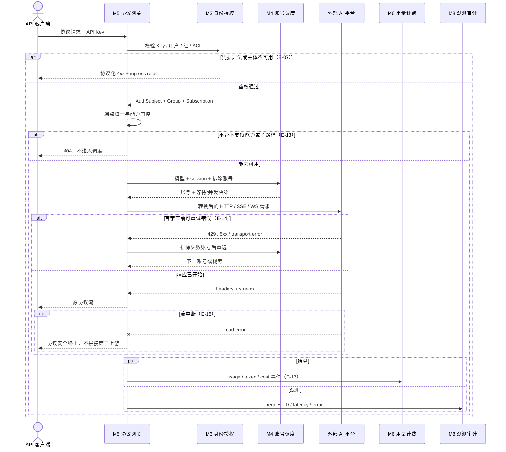
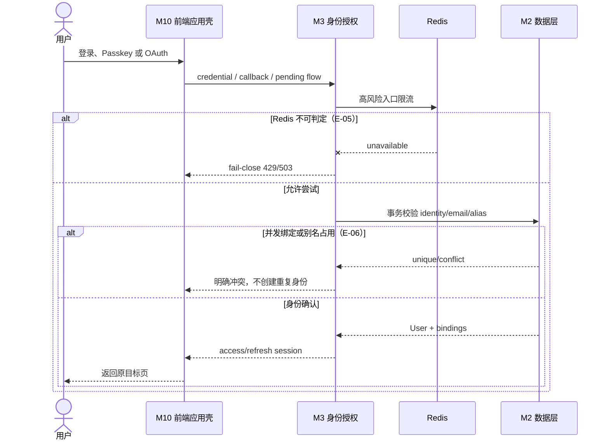
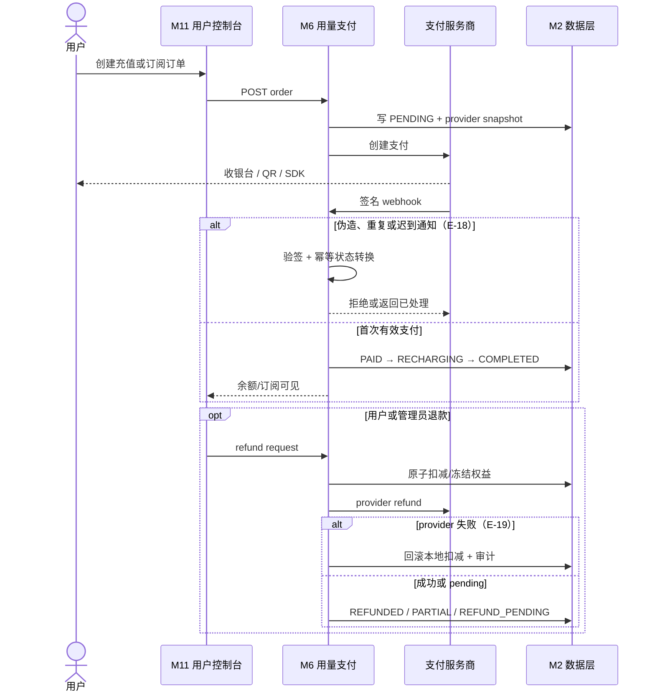
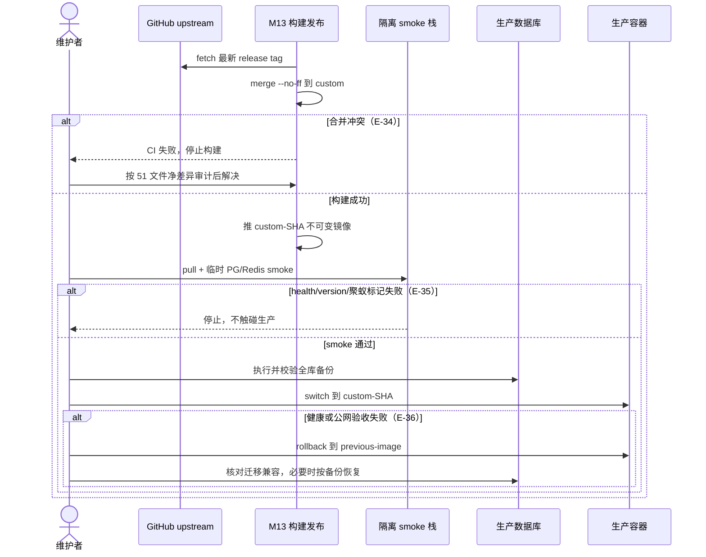

# 10 UX 与关键流程

## 界面状态与文案约定

四个关键流程（下图）之外的通用状态约定，与 09-UI 的文案规范同源：

| 状态 | 约定 | 反例 |
|---|---|---|
| 加载 | 骨架屏或 NavigationProgress；超过瞬时才展示，不闪烁 | 全屏转圈盖住可交互内容 |
| 空态 | 说明这里会有什么 + 第一步动作（「还没有 API Key，创建第一个」） | 只放插画不给出路 |
| 错误 | 协议化错误原样呈现 + 下一步动作；字段错误定位到字段 | 「操作失败」无原因、道歉腔 |
| 成功 | 与触发动作同名（「已生成」「已保存」）；金额/配额变化回显数字 | 万能「操作成功」 |
| 功能关闭 | 设置成功加载且显式为 false 才隐藏；未知保持宽容显示 + 后端兆底（E-27） | 瞬时加载失败当成“功能下线” |
| 危险操作 | 名称写后果（「删除账号」），二次确认复述对象；管理员高危走 step-up（E-30） | 「确定」弹窗无对象 |

## API 网关请求

## 面板登录与身份绑定

## 支付与退款

## 上游版本发布

