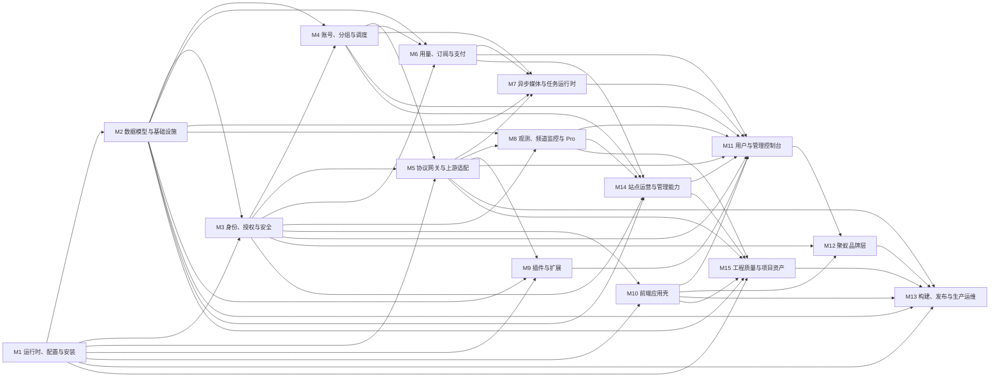
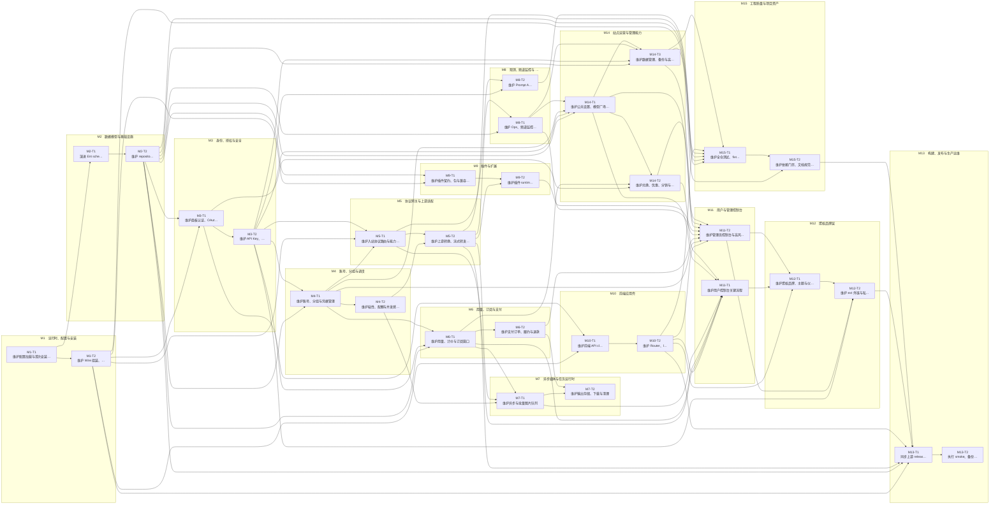

# 聚蚁-sub2api　项目知识库

> 这是本项目的入口。**任何人或模型要动这个项目，从这一页开始。**

## 查东西去哪

| 你想知道 | 去哪 |
|---|---|
| 项目干什么、不干什么 | [[01-项目概览]]、[[02-范围与非目标]] |
| 用什么技术、否掉过什么 | [[05-技术栈]] |
| 某个模块负责什么、代码在哪 | `图谱/模块/<模块ID>.md` |
| 某个任务怎么做、做完没有 | `图谱/任务/<任务ID>.md` |
| 某种异常该怎么处理 | `图谱/边界/<边界ID>.md` |
| 接口长什么样 | [[08-接口约定]] |
| 界面该长什么样 | [[09-UI]]、[[10-UX]] |
| 为什么这么设计 | [[20-关键决策]] |
| 有什么风险没解决 | [[19-风险与技术债]] |
| 整仓代码、测试、工具是否有归属 | [[21-整仓覆盖矩阵]] |

## 规模

15 个模块 · 31 个任务 · 54.5 人天 · 43 条边界（100% 被任务覆盖）

## 模块地图

## 模块

- [[M1]]　运行时、配置与安装：进程入口、环境配置、首次 setup、Wire 组装、HTTP 生命周期和嵌入前端　· 2 任务 · 2 人天
- [[M2]]　数据模型与基础设施：Ent schema、PostgreSQL 迁移、repository、Redis/S3/外部 client adapters　· 2 任务 · 3 人天
- [[M3]]　身份、授权与安全：密码/OAuth/Passkey/2FA/JWT、API Key、ACL、限流、step-up 与审计边界　· 2 任务 · 3.5 人天
- [[M4]]　账号、分组与调度：账号凭据、平台分组、模型路由、sticky、并发、配额和可调度资格　· 2 任务 · 4 人天
- [[M5]]　协议网关与上游适配：入站路由、协议转换、能力门控、HTTP/WS/SSE 转发、failover 与取消传播　· 2 任务 · 4 人天
- [[M6]]　用量、订阅与支付：UsageLog、余额/订阅窗口、计价、订单、provider webhook、履约和退款　· 2 任务 · 4.5 人天
- [[M7]]　异步媒体与任务运行时：异步/批量图片、队列、worker、结算、恢复、输出存储与清理　· 2 任务 · 3.5 人天
- [[M8]]　观测、频道监控与 Prompt Audit：Ops 指标/日志/告警、监控 runner、内容安全策略与审计事件　· 2 任务 · 4 人天
- [[M9]]　插件与扩展：manifest/gRPC 契约、包安装、兼容检查、进程 reconcile、灰度路由和 UI bridge　· 2 任务 · 3.5 人天
- [[M10]]　前端应用壳：API client、token refresh、Pinia stores、Router guards、layout、设置注入与懒加载　· 2 任务 · 3 人天
- [[M11]]　用户与管理控制台：用户 Keys/Usage/Payment/Profile 和管理员 Accounts/Groups/Ops/Settings/Plugins　· 2 任务 · 4 人天
- [[M12]]　聚蚁品牌层：品牌首页、主题字体、蚁群动效、仪表盘增强、ext 外链和禁自更新边界　· 2 任务 · 2.5 人天
- [[M13]]　构建、发布与生产运维：上游 release 同步、私有镜像、隔离 smoke、备份、切换和 rollback　· 2 任务 · 3 人天
- [[M14]]　站点运营与管理能力：公共设置/模型广场、公告、渠道/代理、兑换/优惠/分销、备份/数据管理和管理 CLI　· 3 任务 · 6 人天
- [[M15]]　工程质量与项目资产：全仓测试、fixtures、依赖审计、OpenSpec/文档、开发工具、资源素材和生成物一致性　· 2 任务 · 4 人天

## 任务（按开工批次）

同一批内互不依赖，可以并行派活；跨批必须等前面落地。

### 第 1 批　1 个 · 1 人天　（无前置依赖，可立即开工）
- [[M1-T1]]　维护配置加载与首次安装路径

### 第 2 批　2 个 · 2.5 人天
- [[M1-T2]]　维护 Wire 组装、HTTP 与关闭生命周期
- [[M2-T1]]　演进 Ent schema 与数据库迁移

### 第 3 批　1 个 · 1.5 人天
- [[M2-T2]]　维护 repository、缓存与外部存储适配

### 第 4 批　2 个 · 3.5 人天
- [[M3-T1]]　维护面板认证、OAuth 与身份绑定
- [[M9-T1]]　维护插件契约、包与兼容检查

### 第 5 批　2 个 · 3 人天
- [[M10-T1]]　维护前端 API client、stores 与设置缓存
- [[M3-T2]]　维护 API Key、ACL 与授权中间件

### 第 6 批　2 个 · 3.5 人天
- [[M10-T2]]　维护 Router、layout 与导航守卫
- [[M4-T1]]　维护账号、分组与凭据管理

### 第 7 批　3 个 · 5.5 人天
- [[M4-T2]]　维护粘性、配额与并发感知调度
- [[M5-T1]]　维护入站协议路由与能力门控
- [[M6-T1]]　维护用量、计价与订阅窗口

### 第 8 批　3 个 · 7 人天
- [[M5-T2]]　维护上游转换、流式转发与 failover
- [[M6-T2]]　维护支付订单、履约与退款
- [[M8-T2]]　维护 Prompt Audit 与安全策略

### 第 9 批　3 个 · 6 人天
- [[M7-T1]]　维护异步与批量图片队列
- [[M8-T1]]　维护 Ops、频道监控与告警
- [[M9-T2]]　维护插件 runtime、reconcile 与路由

### 第 10 批　2 个 · 3.5 人天
- [[M14-T1]]　维护公共设置、模型广场与渠道连接
- [[M7-T2]]　维护输出存储、下载与清理

### 第 11 批　2 个 · 4 人天
- [[M14-T2]]　维护兑换、优惠、分销与用户扩展权益
- [[M14-T3]]　维护数据管理、备份与高级运营工具

### 第 12 批　3 个 · 6 人天
- [[M11-T1]]　维护用户控制台关键流程
- [[M11-T2]]　维护管理员控制台与高风险操作
- [[M15-T1]]　维护全仓测试、fixtures 与生成物一致性

### 第 13 批　2 个 · 3.5 人天
- [[M12-T1]]　维护聚蚁品牌、主题与仪表盘增强
- [[M15-T2]]　维护依赖门禁、文档规范与项目资源

### 第 14 批　1 个 · 1 人天
- [[M12-T2]]　维护 ext 外链与私有发布安全边界

### 第 15 批　1 个 · 1.5 人天
- [[M13-T1]]　同步上游 release 并构建私有镜像

### 第 16 批　1 个 · 1.5 人天
- [[M13-T2]]　执行 smoke、备份、切换与回滚验收

### 依赖全景

箭头指向被阻塞的一方；同一列内的任务互不依赖。

## 边界

- [[E-01]]　首次安装尚未完成　→ [[M1-T1]]
- [[E-02]]　配置或迁移失败　→ [[M1-T1]]、[[M2-T1]]
- [[E-03]]　进程退出时仍有请求和 worker　→ [[M1-T2]]
- [[E-04]]　Redis 缓存缺失、陈旧或不可用　→ [[M2-T2]]
- [[E-05]]　高风险认证限流无法判定　→ [[M3-T1]]
- [[E-06]]　身份或邮箱并发绑定　→ [[M3-T1]]
- [[E-07]]　非法 API Key 输入与枚举滥用　→ [[M3-T2]]
- [[E-08]]　Key 过期或额度耗尽后读取自身信息　→ [[M3-T2]]
- [[E-09]]　账号凭据经 DTO、日志或管理接口泄漏　→ [[M4-T1]]
- [[E-10]]　Sticky 账号满载或失去资格　→ [[M4-T2]]
- [[E-11]]　调度缓存或 outbox 落后　→ [[M4-T2]]
- [[E-12]]　上游配额或并发限制　→ [[M4-T2]]
- [[E-13]]　平台不支持端点或 Responses 子路径　→ [[M5-T1]]
- [[E-14]]　首字节前的可重试上游失败　→ [[M5-T2]]
- [[E-15]]　流开始后上游中断　→ [[M5-T2]]
- [[E-16]]　客户端取消或 deadline 到期　→ [[M5-T2]]
- [[E-17]]　必须落账的 usage 事件拥塞　→ [[M6-T1]]
- [[E-18]]　支付通知伪造、重复、乱序或迟到　→ [[M6-T2]]
- [[E-19]]　退款远端与本地状态分裂　→ [[M6-T2]]
- [[E-20]]　Worker 崩溃留下活跃任务或 billing hold　→ [[M7-T1]]
- [[E-21]]　批量任务重复提交　→ [[M7-T1]]
- [[E-22]]　异步输出越权、过期或已删除　→ [[M7-T2]]
- [[E-23]]　Ops/监控链路不可用　→ [[M8-T1]]
- [[E-24]]　Prompt Audit 启动或扫描不可用　→ [[M8-T2]]
- [[E-25]]　插件包不兼容或路径不安全　→ [[M9-T1]]
- [[E-26]]　插件权威状态不可读或 runtime 不健康　→ [[M9-T2]]
- [[E-27]]　公共设置或 token refresh 瞬时失败　→ [[M10-T1]]
- [[E-28]]　发布后浏览器仍引用旧 chunk　→ [[M10-T2]]
- [[E-29]]　UI 功能开关、后端模式或支付恢复不一致　→ [[M11-T1]]
- [[E-30]]　管理员高风险操作缺少再验证　→ [[M11-T2]]
- [[E-31]]　管理员首页覆盖与动效降级　→ [[M12-T1]]
- [[E-32]]　`ext:` 外链格式非法或 opener 风险　→ [[M12-T2]]
- [[E-33]]　管理台执行官方自更新覆盖二开　→ [[M12-T2]]
- [[E-34]]　上游 release 合并冲突或镜像版本标错　→ [[M13-T1]]
- [[E-35]]　Smoke 污染生产或未备份就切换　→ [[M13-T2]]
- [[E-36]]　回滚镜像与前向 schema 不兼容　→ [[M13-T2]]
- [[E-37]]　公共设置、模型广场或公告读取状态不确定　→ [[M14-T1]]
- [[E-38]]　代理、渠道或定时探测访问不可信目标　→ [[M14-T1]]、[[M14-T3]]
- [[E-39]]　兑换码、优惠码或分销额度被并发重放　→ [[M14-T2]]
- [[E-40]]　备份、导入导出或数据维护泄漏/半完成　→ [[M14-T3]]
- [[E-41]]　测试、fixture 或生成代码与实现漂移　→ [[M15-T1]]
- [[E-42]]　依赖漏洞例外失效或锁文件漂移　→ [[M15-T2]]
- [[E-43]]　文档、OpenSpec、管理技能或资源与代码不一致　→ [[M15-T2]]

## 章节目录

**概览**
[[01-项目概览]]　[[02-范围与非目标]]

**约束**
[[05-技术栈]]

**设计**
[[06-系统架构与模块划分]]　[[07-数据模型]]　[[08-接口约定]]　[[09-UI]]　[[10-UX]]

**质量**
[[11-边界问题与异常处理]]　[[14-测试与验证策略]]

**执行**
[[17-模块任务拆分]]　[[18-开发与发布流程]]　[[19-风险与技术债]]　[[20-关键决策]]

**附录**
[[21-整仓覆盖矩阵]]　[[22-知识库维护]]

---

_`图谱/` 下的笔记由 `build_vault.py` 从 22 节的表格派生。改这些笔记的正文没用，下次重跑会被覆盖——要改内容请改对应章节的表格，再重跑脚本。只有「代码位置」「实施沉淀」「验证记录」这几段是受保护的，重跑不动它们。_
