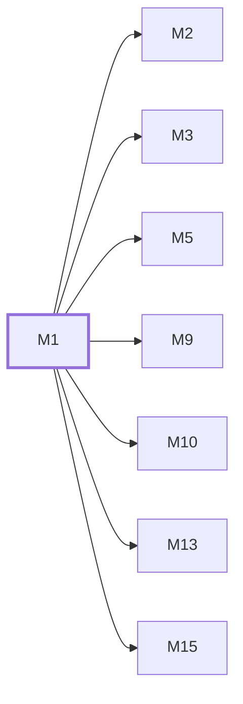

# M1　运行时、配置与安装：进程入口、环境配置、首次 setup、Wire 组装、HTTP 生命周期和嵌入前端

## 依赖关系

- 本模块依赖：无，可最先开工
- 被依赖：[[M2]]、[[M3]]、[[M5]]、[[M9]]、[[M10]]、[[M13]]、[[M15]]

## 下辖任务（2 个 · 2 人天）

| 任务 | 标题 | 预估 | 覆盖边界 |
|---|---|---|---|
| [[M1-T1]] | 维护配置加载与首次安装路径 | 1d | [[E-01]]、[[E-02]] |
| [[M1-T2]] | 维护 Wire 组装、HTTP 与关闭生命周期 | 1d | [[E-03]] |

## 涉及的边界

- [[E-01]]　首次安装尚未完成
- [[E-02]]　配置或迁移失败
- [[E-03]]　进程退出时仍有请求和 worker

## 代码位置

<!-- code:begin -->
- `backend/cmd/server/main.go` — 进程模式选择、主服务启动与优雅关闭
- `backend/internal/config/` — 配置加载、默认值和环境校验
- `backend/internal/setup/` — 首次安装向导与自动初始化
- `backend/internal/server/` — HTTP server、router、routes 和 middleware 组装
- `backend/internal/web/` — 嵌入前端服务、设置注入与 HTML/静态缓存
- `backend/internal/handler/dto/` — 面板 DTO 契约与凭据脱敏
- `backend/internal/handler/handler.go` — Handlers 聚合与 Wire 装配
- `backend/internal/util/` — 日志脱敏、URL 校验、响应头与 HTTP 工具
- `backend/internal/pkg/` — 通用基础包根（errors/logger/httpclient/response/servertiming/timezone 等；协议/安全子包见 M5/M3）
- `backend/internal/service/idempotency.go` — 幂等键服务、清理与观测
- `backend/internal/service/domain_constants.go` — 设置键与平台共享常量
- `backend/internal/service/timing_wheel_service.go` — 通用时间轮服务
- `backend/internal/handler/wire.go` — handler/service Wire providers
<!-- code:end -->

## 备注

<!-- notes:begin -->
Setup 在主应用 Wire 初始化之前分流，未初始化实例不会带着半配置进入常规路由。进程退出由 main 统一编排，新增后台 runtime 必须接入 Application cleanup，否则容器停止会留下未结算工作。
<!-- notes:end -->
