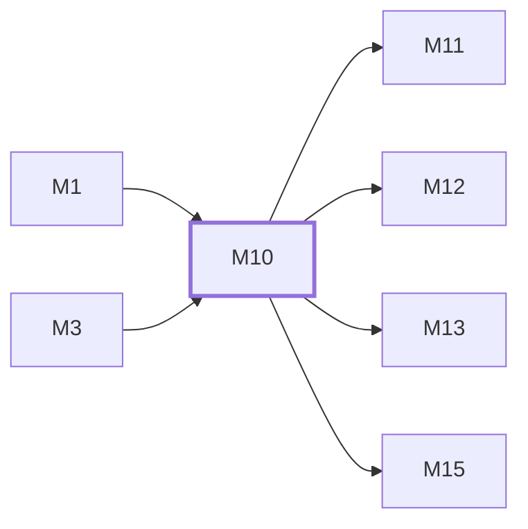

# M10　前端应用壳：API client、token refresh、Pinia stores、Router guards、layout、设置注入与懒加载

## 依赖关系

- 本模块依赖：[[M1]]、[[M3]]
- 被依赖：[[M11]]、[[M12]]、[[M13]]、[[M15]]

## 下辖任务（2 个 · 3 人天）

| 任务 | 标题 | 预估 | 覆盖边界 |
|---|---|---|---|
| [[M10-T1]] | 维护前端 API client、stores 与设置缓存 | 1.5d | [[E-27]] |
| [[M10-T2]] | 维护 Router、layout 与导航守卫 | 1.5d | [[E-28]] |

## 涉及的边界

- [[E-27]]　公共设置或 token refresh 瞬时失败
- [[E-28]]　发布后浏览器仍引用旧 chunk

## 代码位置

<!-- code:begin -->
- `frontend/src/api/client.ts` — HTTP client 与统一错误模型
- `frontend/src/api/tokenRefresh.ts` — token refresh 协调
- `frontend/src/stores/` — auth、app、settings 和业务状态
- `frontend/src/router/` — lazy routes、守卫与标题/setup 重定向 helper
- `frontend/src/components/layout/` — 应用、认证和侧栏 layout
- `frontend/src/utils/` — sanitize、URL、featureFlags 等共享工具
- `frontend/src/composables/` — OAuth、剪贴板、自动刷新等组合式函数
- `frontend/src/types/` — 共享类型定义
- `frontend/src/constants/` — 共享常量
- `frontend/src/i18n/` — 中英文案与 juyi 命名空间
- `frontend/index.html` — 入口 HTML 与 favicon
- `frontend/src/assets/icons/` — 支付渠道等图标资产
- `frontend/src/main.ts` — 应用引导与聚蚁外观初始化
- `frontend/src/style.css` — 全局样式（onboarding/announcement css 同目录）
<!-- code:end -->

## 备注

<!-- notes:begin -->
公共设置加载失败代表未知状态，不代表功能明确关闭；最终授权由后端兜底。并发 401 应共享一次 refresh，部署后的旧 chunk 只允许有限自动刷新，避免认证和资源错误形成重定向/刷新循环。
<!-- notes:end -->
