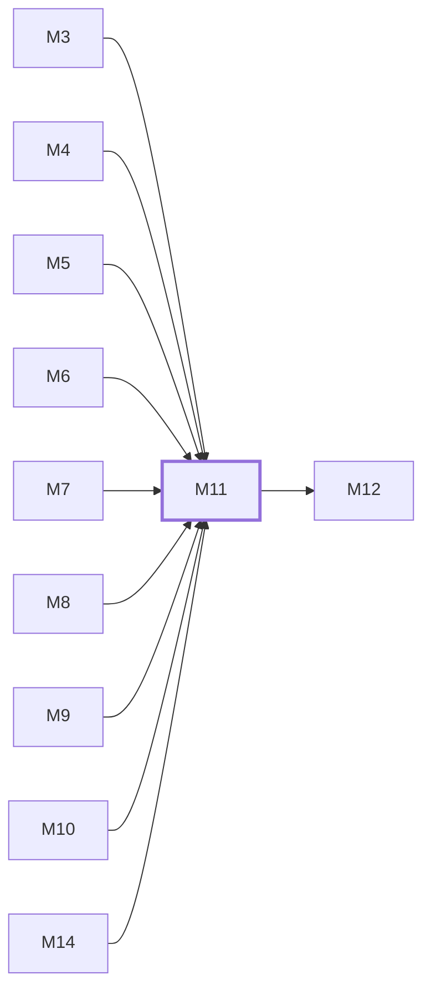

# M11　用户与管理控制台：用户 Keys/Usage/Payment/Profile 和管理员 Accounts/Groups/Ops/Settings/Plugins

## 依赖关系

- 本模块依赖：[[M3]]、[[M4]]、[[M5]]、[[M6]]、[[M7]]、[[M8]]、[[M9]]、[[M10]]、[[M14]]
- 被依赖：[[M12]]

## 下辖任务（2 个 · 4 人天）

| 任务 | 标题 | 预估 | 覆盖边界 |
|---|---|---|---|
| [[M11-T1]] | 维护用户控制台关键流程 | 2d | [[E-29]] |
| [[M11-T2]] | 维护管理员控制台与高风险操作 | 2d | [[E-30]] |

## 涉及的边界

- [[E-29]]　UI 功能开关、后端模式或支付恢复不一致
- [[E-30]]　管理员高风险操作缺少再验证

## 代码位置

<!-- code:begin -->
- `frontend/src/views/user/` — 用户控制台页面
- `frontend/src/views/admin/` — 管理控制台页面
- `frontend/src/api/admin/` — 管理 API client
- `frontend/src/components/account/` — 账号编辑、配额和测试组件
- `frontend/src/components/payment/` — 支付与订单组件
- `frontend/src/api/` — 面板 API client 根（auth/keys/usage/payment/订阅等；admin 子目录见上）
- `frontend/src/components/common/` — 表格、弹窗、徽章等通用组件
- `frontend/src/components/keys/` — Key 使用与端点弹窗
- `frontend/src/components/auth/` — 登录、OAuth 与 2FA 组件
- `frontend/src/components/charts/` — 仪表盘图表
- `frontend/src/components/modelPlaza/` — 模型广场组件
- `frontend/src/components/channels/` — 渠道定价与模型表组件
- `frontend/src/components/admin/` — 管理端组件（账号/公告/渠道/分组/监控子目录）
- `frontend/src/components/user/` — 用户端组件（配额/用量/属性）
- `frontend/src/components/icons/` — 通用图标
- `frontend/src/components/Guide/` — 新手引导步骤
- `frontend/src/components/CaptchaChallenge.vue` — 阿里云/腾讯/Turnstile 验证码组件族
- `frontend/src/views/auth/` — 登录/注册/OAuth 回调页
- `frontend/src/views/setup/` — 初始化向导页
- `frontend/src/views/public/` — 法律文档页
- `backend/internal/handler/admin/dashboard_handler.go` — 管理仪表盘端点与聚合缓存族
- `frontend/src/views/` — 根级独立页（KeyUsage/ModelPlaza/NotFound；用户/管理员子目录见上）
- `frontend/src/components/TurnstileWidget.vue` — Turnstile/阿里云/腾讯验证码组件族
<!-- code:end -->

## 备注

<!-- notes:begin -->
控制台负责可恢复交互和状态解释，不拥有最终授权或账务事实。管理员批量/高风险操作必须保留 audit、compliance/step-up 与后端事务边界，前端成功提示只能基于后端已确认结果。
<!-- notes:end -->
