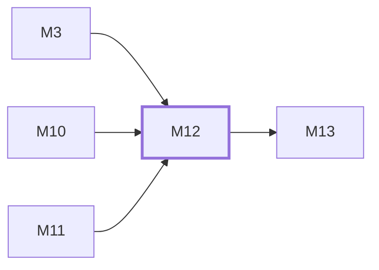

# M12　聚蚁品牌层：品牌首页、主题字体、蚁群动效、仪表盘增强、ext 外链和禁自更新边界

## 依赖关系

- 本模块依赖：[[M3]]、[[M10]]、[[M11]]
- 被依赖：[[M13]]

## 下辖任务（2 个 · 2.5 人天）

| 任务 | 标题 | 预估 | 覆盖边界 |
|---|---|---|---|
| [[M12-T1]] | 维护聚蚁品牌、主题与仪表盘增强 | 1.5d | [[E-31]] |
| [[M12-T2]] | 维护 ext 外链与私有发布安全边界 | 1d | [[E-32]]、[[E-33]] |

## 涉及的边界

- [[E-31]]　管理员首页覆盖与动效降级
- [[E-32]]　`ext:` 外链格式非法或 opener 风险
- [[E-33]]　管理台执行官方自更新覆盖二开

## 代码位置

<!-- code:begin -->
- `frontend/src/views/home/JuyiHome.vue` — 聚蚁默认落地页
- `frontend/src/components/juyi/` — 主题入口、蚁群和双仪表盘增强
- `frontend/src/styles/juyi.css` — 主题变量、字体和品牌动效
- `frontend/src/components/layout/AppSidebar.vue` — ext 外链与外观入口
- `backend/internal/handler/admin/setting_handler_update.go` — ext URL 后端验证
- `frontend/public/` — 品牌 logo/favicon 静态资产
- `frontend/src/assets/fonts/` — vendored 品牌字体
- `frontend/src/components/brand/BrandMark.vue` — 品牌标识组件
- `frontend/src/components/home/AntTrailPipeline.vue` — 蚁径管线 hero
- `frontend/src/i18n/locales/zh/juyi.ts` — juyi 文案（en 同名同族）
<!-- code:end -->

## 备注

<!-- notes:begin -->
聚蚁默认首页服从管理员 home_content 覆盖，主题色只接管品牌位，不覆盖平台和状态语义。私有发布边界由 ext 前后端闭环和 allowSelfUpdate=false 共同守住；上游合并后必须重新搜索这些标记。
<!-- notes:end -->
