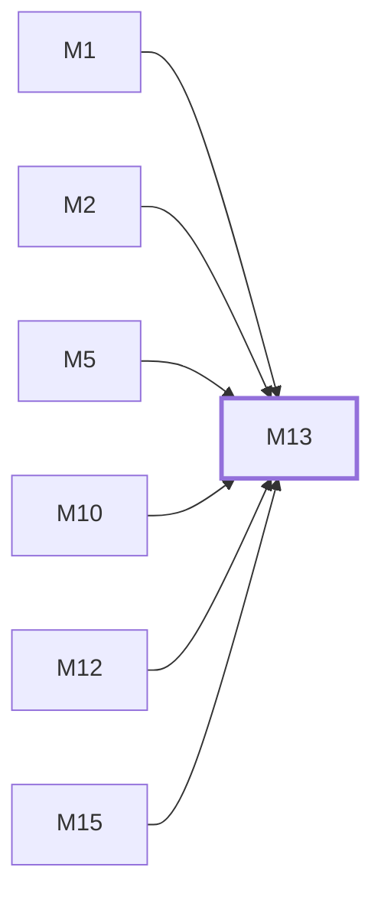

# M13　构建、发布与生产运维：上游 release 同步、私有镜像、隔离 smoke、备份、切换和 rollback

## 依赖关系

- 本模块依赖：[[M1]]、[[M2]]、[[M5]]、[[M10]]、[[M12]]、[[M15]]
- 被依赖：无，没有模块等它

## 下辖任务（2 个 · 3 人天）

| 任务 | 标题 | 预估 | 覆盖边界 |
|---|---|---|---|
| [[M13-T1]] | 同步上游 release 并构建私有镜像 | 1.5d | [[E-34]] |
| [[M13-T2]] | 执行 smoke、备份、切换与回滚验收 | 1.5d | [[E-35]]、[[E-36]] |

## 涉及的边界

- [[E-34]]　上游 release 合并冲突或镜像版本标错
- [[E-35]]　Smoke 污染生产或未备份就切换
- [[E-36]]　回滚镜像与前向 schema 不兼容

## 代码位置

<!-- code:begin -->
- `.github/workflows/custom-build.yml` — release 同步与私有镜像构建
- `Dockerfile` — 前后端生产镜像
- `deploy/docker-compose.yml` — 标准 app/PostgreSQL/Redis 拓扑
- `deploy/juyi/update-from-ghcr.sh` — pull/smoke/switch/rollback
- `deploy/juyi/smoke-compose.yml` — 隔离 smoke 数据栈
- `.github/workflows/` — CI 根：custom-build 主线；上游 CI/release/security/CLA 已对齐或禁用
- `Makefile` — 根构建入口
- `Dockerfile.goreleaser` — goreleaser 打包镜像（.goreleaser*.yaml 同族）
- `backend/Dockerfile` — 后端镜像构建（backend/Makefile、.dockerignore 同目录）
- `deploy/` — 部署资产根：Compose 变体、安装/入口脚本、Caddy、systemd、示例与文档
- `deploy/juyi/seed-buy-menu.sql` — 兑换码购买菜单 seed
- `backend/scripts/resolve-version.sh` — 构建版本解析脚本
<!-- code:end -->

## 备注

<!-- notes:begin -->
生产身份是不可变 custom SHA 镜像，不是 CI 触发 head SHA 或移动标签。Smoke 证明候选能在临时数据栈启动，但不能代替生产备份；前向迁移使镜像回滚与数据库回滚成为两个独立判断。
<!-- notes:end -->
