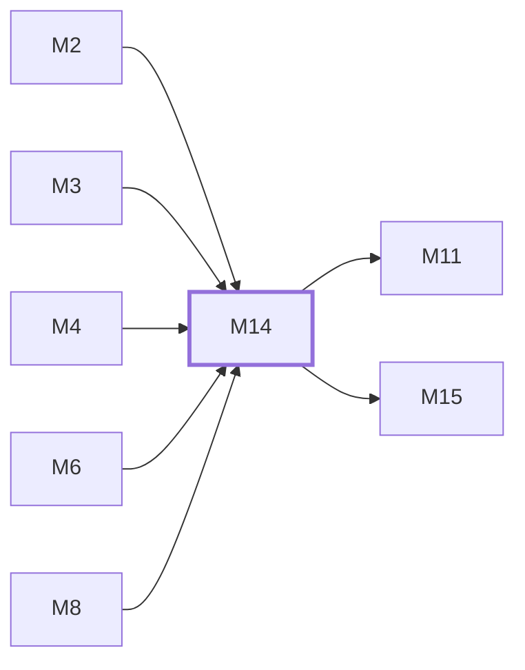

# M14　站点运营与管理能力：公共设置/模型广场、公告、渠道/代理、兑换/优惠/分销、备份/数据管理和管理 CLI

## 依赖关系

- 本模块依赖：[[M2]]、[[M3]]、[[M4]]、[[M6]]、[[M8]]
- 被依赖：[[M11]]、[[M15]]

## 下辖任务（3 个 · 6 人天）

| 任务 | 标题 | 预估 | 覆盖边界 |
|---|---|---|---|
| [[M14-T1]] | 维护公共设置、模型广场与渠道连接 | 2d | [[E-37]]、[[E-38]] |
| [[M14-T2]] | 维护兑换、优惠、分销与用户扩展权益 | 2d | [[E-39]] |
| [[M14-T3]] | 维护数据管理、备份与高级运营工具 | 2d | [[E-38]]、[[E-40]] |

## 涉及的边界

- [[E-37]]　公共设置、模型广场或公告读取状态不确定
- [[E-38]]　代理、渠道或定时探测访问不可信目标
- [[E-39]]　兑换码、优惠码或分销额度被并发重放
- [[E-40]]　备份、导入导出或数据维护泄漏/半完成

## 代码位置

<!-- code:begin -->
- `backend/internal/server/routes/admin.go:430-816` — 公告、代理、兑换/优惠、设置、数据管理、备份、渠道、分销等管理路由
- `backend/internal/server/routes/user.go:16-158` — 用户资料、分销、公告、兑换、渠道与监控入口
- `backend/internal/server/routes/model_plaza.go` — 模型广场 optional-auth 与 backend-mode 边界
- `backend/internal/service/setting_service.go` — 站点设置业务入口和缓存失效
- `backend/internal/service/proxy_service.go` — 代理生命周期与质量管理
- `backend/internal/service/redeem_service.go` — 兑换核销与权益写入
- `backend/internal/service/backup_service.go` — 数据库备份/恢复编排
- `skills/sub2api-admin/` — 管理 API CLI、命令参考和操作安全规则
- `backend/internal/service/email_service.go` — 邮件发送、队列与通知服务族
- `backend/internal/service/system_operation_lock_service.go` — 运维操作锁与 leader 锁
- `backend/internal/service/update_service.go` — GitHub release 版本检查（只读更新提示）
- `backend/internal/service/settings_view.go` — 设置视图投影
- `backend/internal/handler/admin/system_handler.go` — 系统/合规/快照缓存管理端点族
- `backend/internal/handler/available_channel_handler.go` — 用户可用渠道与自定义页面端点
- `backend/internal/handler/admin/compliance_handler.go` — 合规确认端点（id_list/snapshot helper 同目录）
- `backend/internal/service/notification_email_service.go` — 通知邮箱服务族
- `backend/internal/service/leader_lock.go` — leader 锁（deferred/slice/sql_errors 等小工具同层）
- `backend/internal/handler/page_handler.go` — 自定义页面端点
<!-- code:end -->

## 备注

<!-- notes:begin -->
运营能力横跨匿名、用户和管理员三类路由，但 PostgreSQL 设置/权益/审计仍是事实源。前端设置未知时保持宽容，后端必须按持久化开关和身份最终裁决；代理探测、数据导出和备份等高风险能力还需 URL 安全、step-up、超时、路径与大小边界。仓库内 admin skill 是正式操作入口，批量写前必须先只读解析目标集，写后复查。
<!-- notes:end -->
