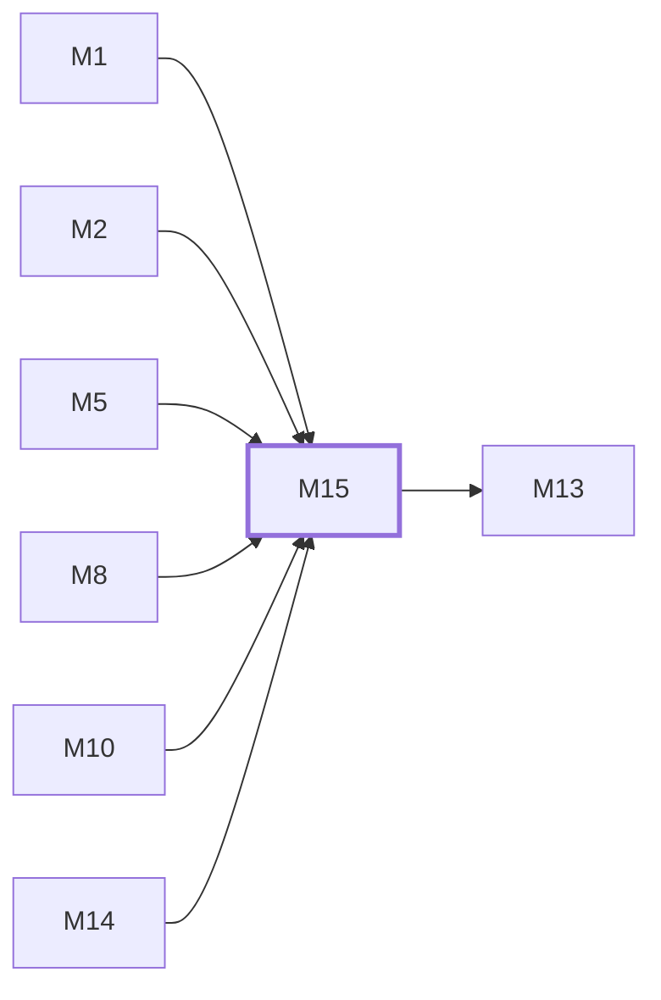

# M15　工程质量与项目资产：全仓测试、fixtures、依赖审计、OpenSpec/文档、开发工具、资源素材和生成物一致性

## 依赖关系

- 本模块依赖：[[M1]]、[[M2]]、[[M5]]、[[M8]]、[[M10]]、[[M14]]
- 被依赖：[[M13]]

## 下辖任务（2 个 · 4 人天）

| 任务 | 标题 | 预估 | 覆盖边界 |
|---|---|---|---|
| [[M15-T1]] | 维护全仓测试、fixtures 与生成物一致性 | 2d | [[E-41]] |
| [[M15-T2]] | 维护依赖门禁、文档规范与项目资源 | 2d | [[E-42]]、[[E-43]] |

## 涉及的边界

- [[E-41]]　测试、fixture 或生成代码与实现漂移
- [[E-42]]　依赖漏洞例外失效或锁文件漂移
- [[E-43]]　文档、OpenSpec、管理技能或资源与代码不一致

## 代码位置

<!-- code:begin -->
- `backend/internal/integration/` — 网关与用户流程端到端测试
- `backend/internal/testutil/` — 后端共享测试设施
- `frontend/src/__tests__/` — 前端跨模块集成回归
- `deploy/tests/` — Compose、安装、资源和安全配置测试
- `tools/check_pnpm_audit_exceptions.py` — pnpm 高危漏洞例外字段、匹配与到期校验
- `openspec/changes/add-openai-compatible-prompt-audit/` — Prompt Audit 设计、冻结源和实施证据
- `docs/` — 对外 API、功能、合规和运维文档
- `docs/聚蚁-sub2api-开发文档/_run/check_coverage.py` — tracked file 到模块的整仓覆盖门
- `backend/internal/service/testdata/` — service 层协议与邮件 HTML fixture
- `frontend/src/api/__tests__/` — API client 测试（其余 `__tests__` 目录同约定）
- `assets/` — README 与伙伴展示素材
- `openspec/config.yaml` — OpenSpec 配置
- `DEV_GUIDE.md` — 上游开发指南（README 三语、License、CLA、.gitattributes 同级）
- `frontend/vite.config.ts` — 前端构建配置族（tsconfig/postcss/eslint/.npmrc/audit.json 同级）
<!-- code:end -->

## 备注

<!-- notes:begin -->
测试与实现共址，因此 M15 负责质量机制而不接管各业务断言的语义所有权。Schema、Wire、proto、嵌入前端和 fixtures 必须从权威源重生成，不能手改生成物掩盖漂移。依赖例外要精确绑定 package+advisory 并设置缓解措施和到期日；文档、OpenSpec、管理 skill、定价资源和素材随同代码变更，且不得保存真实凭据。
<!-- notes:end -->
