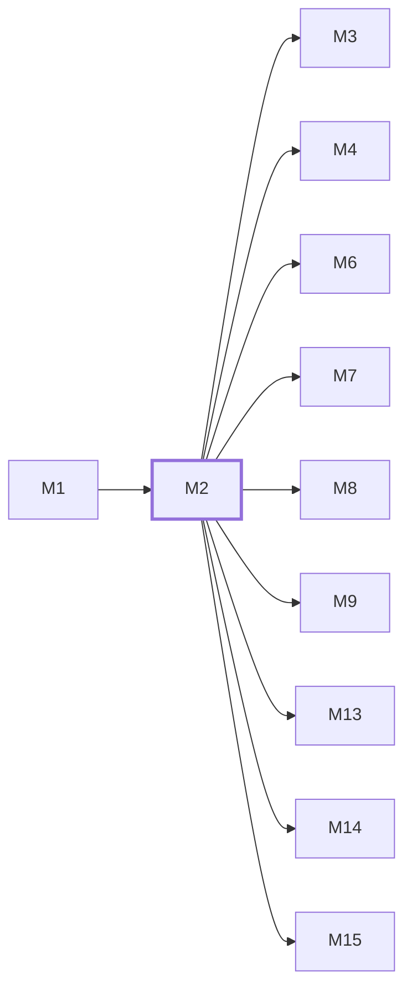

# M2　数据模型与基础设施：Ent schema、PostgreSQL 迁移、repository、Redis/S3/外部 client adapters

## 依赖关系

- 本模块依赖：[[M1]]
- 被依赖：[[M3]]、[[M4]]、[[M6]]、[[M7]]、[[M8]]、[[M9]]、[[M13]]、[[M14]]、[[M15]]

## 下辖任务（2 个 · 3 人天）

| 任务 | 标题 | 预估 | 覆盖边界 |
|---|---|---|---|
| [[M2-T1]] | 演进 Ent schema 与数据库迁移 | 1.5d | [[E-02]] |
| [[M2-T2]] | 维护 repository、缓存与外部存储适配 | 1.5d | [[E-04]] |

## 涉及的边界

- [[E-02]]　配置或迁移失败
- [[E-04]]　Redis 缓存缺失、陈旧或不可用

## 代码位置

<!-- code:begin -->
- `backend/ent/schema/` — Ent 业务 schema 的事实来源
- `backend/migrations/` — 跨版本 PostgreSQL 迁移
- `backend/internal/repository/` — Ent、Redis、S3 与外部设施 adapters
- `backend/ent/` — 生成代码，只从 schema 重新生成
- `backend/internal/domain/` — 跨域常量、模型路由配置与推理档位规则
- `backend/internal/model/` — 错误透传规则与 TLS 指纹领域模型
<!-- code:end -->

## 备注

<!-- notes:begin -->
PostgreSQL 保存身份、余额、订单、订阅和用量事实；Redis 状态必须可重建。Ent 生成文件不手改，任何约束变更都从 schema 和 migration 开始，并同时检查缓存失效与回源行为。
<!-- notes:end -->
