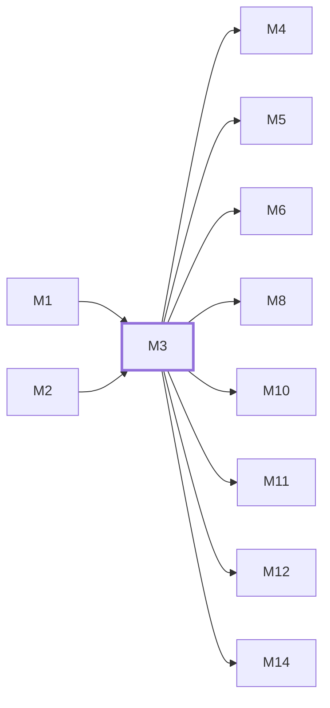

# M3　身份、授权与安全：密码/OAuth/Passkey/2FA/JWT、API Key、ACL、限流、step-up 与审计边界

## 依赖关系

- 本模块依赖：[[M1]]、[[M2]]
- 被依赖：[[M4]]、[[M5]]、[[M6]]、[[M8]]、[[M10]]、[[M11]]、[[M12]]、[[M14]]

## 下辖任务（2 个 · 3.5 人天）

| 任务 | 标题 | 预估 | 覆盖边界 |
|---|---|---|---|
| [[M3-T1]] | 维护面板认证、OAuth 与身份绑定 | 2d | [[E-05]]、[[E-06]] |
| [[M3-T2]] | 维护 API Key、ACL 与授权中间件 | 1.5d | [[E-07]]、[[E-08]] |

## 涉及的边界

- [[E-05]]　高风险认证限流无法判定
- [[E-06]]　身份或邮箱并发绑定
- [[E-07]]　非法 API Key 输入与枚举滥用
- [[E-08]]　Key 过期或额度耗尽后读取自身信息

## 代码位置

<!-- code:begin -->
- `backend/internal/server/routes/auth.go` — 面板认证与 OAuth 路由
- `backend/internal/server/middleware/` — JWT、API Key、ACL、step-up 和审计中间件
- `backend/internal/service/auth_service.go` — 用户认证核心
- `backend/internal/service/api_key_service.go` — API Key 查询、缓存与维护
- `backend/internal/middleware/rate_limiter.go` — 面板/认证 Redis 限流与 fail-close
- `backend/internal/pkg/oauth/` — OAuth 共享实现（PKCE/state）
- `backend/internal/pkg/redissession/` — 会话绑定 Redis 存储
- `backend/internal/service/totp_service.go` — TOTP/2FA 与验证码服务族
- `backend/internal/service/turnstile_service.go` — Turnstile/阿里云/腾讯验证码
- `backend/internal/service/oauth_service.go` — OAuth 授权/refresh/身份服务族
- `backend/internal/service/invalid_auth_abuse_limiter.go` — 无效凭据滥用限流
- `backend/internal/service/registration_email_policy.go` — 注册邮箱别名与策略
- `backend/cmd/jwtgen/` — 运维 JWT 生成工具
- `backend/internal/handler/admin/apikey_handler.go` — 管理员 Key 归组端点
- `backend/internal/service/ratelimit_service.go` — 上游限流/401 回退服务族
- `backend/internal/service/identity_service.go` — 身份 UA 校验与排序族
<!-- code:end -->

## 备注

<!-- notes:begin -->
认证入口的限流和身份唯一性属于安全边界，Redis 不可判定时高风险入口选择 fail-close。API Key 的 Authentication 与 Billing Enforcement 故意分层，skipBilling 端点仍必须校验 Key、用户、组和 ACL。
<!-- notes:end -->
