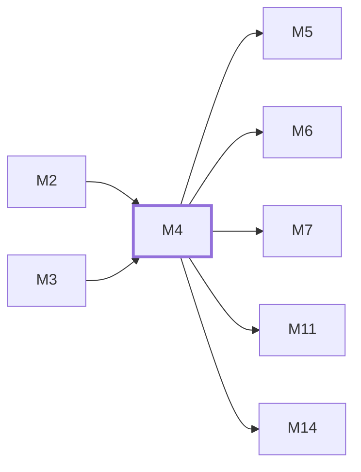

# M4　账号、分组与调度：账号凭据、平台分组、模型路由、sticky、并发、配额和可调度资格

## 依赖关系

- 本模块依赖：[[M2]]、[[M3]]
- 被依赖：[[M5]]、[[M6]]、[[M7]]、[[M11]]、[[M14]]

## 下辖任务（2 个 · 4 人天）

| 任务 | 标题 | 预估 | 覆盖边界 |
|---|---|---|---|
| [[M4-T1]] | 维护账号、分组与凭据管理 | 2d | [[E-09]] |
| [[M4-T2]] | 维护粘性、配额与并发感知调度 | 2d | [[E-10]]、[[E-11]]、[[E-12]] |

## 涉及的边界

- [[E-09]]　账号凭据经 DTO、日志或管理接口泄漏
- [[E-10]]　Sticky 账号满载或失去资格
- [[E-11]]　调度缓存或 outbox 落后
- [[E-12]]　上游配额或并发限制

## 代码位置

<!-- code:begin -->
- `backend/internal/handler/admin/account_handler.go` — 管理端账号入口
- `backend/internal/handler/admin/group_handler.go` — 管理端分组入口
- `backend/internal/service/account_service.go` — 账号与凭据生命周期
- `backend/internal/service/gateway_scheduling.go` — sticky、模型、负载与并发调度
- `backend/internal/service/scheduler_outbox.go` — 调度缓存事件同步
- `backend/internal/handler/quotaview/` — 配额视图聚合 helper
- `backend/internal/handler/admin/grok_oauth_handler.go` — Grok/Gemini/Antigravity OAuth 管理端点族
- `backend/internal/service/session_binding.go` — 会话绑定/会话 ID/限制服务族
- `backend/internal/service/concurrency_service.go` — 并发槽与临时不可调度/影子凭据族
- `backend/internal/service/refresh_policy.go` — token 刷新策略与 RPM 缓存族
- `backend/internal/service/quota_fetcher.go` — 配额抓取族（RPM 缓存/临时不可调度同族）
- `backend/internal/service/credential_shadow.go` — 凭据影子/脱敏/影子路由族
- `backend/internal/service/temp_unsched.go` — 临时不可调度与并发槽辅助族
<!-- code:end -->

## 备注

<!-- notes:begin -->
账号管理状态、可调度资格、配额窗口和并发占用是不同维度。Sticky 是偏好绑定而不是强制永久占槽；容量溢出只影响本次选择，不应迁移持久绑定，缓存故障回源也必须受 QPS/timeout 约束。
<!-- notes:end -->
