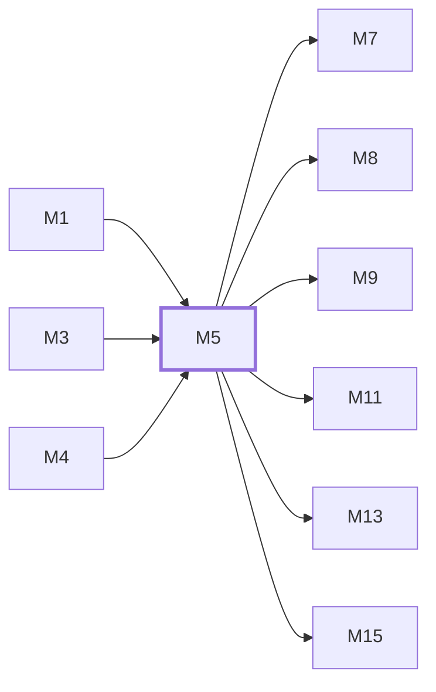

# M5　协议网关与上游适配：入站路由、协议转换、能力门控、HTTP/WS/SSE 转发、failover 与取消传播

## 依赖关系

- 本模块依赖：[[M1]]、[[M3]]、[[M4]]
- 被依赖：[[M7]]、[[M8]]、[[M9]]、[[M11]]、[[M13]]、[[M15]]

## 下辖任务（2 个 · 4 人天）

| 任务 | 标题 | 预估 | 覆盖边界 |
|---|---|---|---|
| [[M5-T1]] | 维护入站协议路由与能力门控 | 1.5d | [[E-13]] |
| [[M5-T2]] | 维护上游转换、流式转发与 failover | 2.5d | [[E-14]]、[[E-15]]、[[E-16]] |

## 涉及的边界

- [[E-13]]　平台不支持端点或 Responses 子路径
- [[E-14]]　首字节前的可重试上游失败
- [[E-15]]　流开始后上游中断
- [[E-16]]　客户端取消或 deadline 到期

## 代码位置

<!-- code:begin -->
- `backend/internal/server/routes/gateway.go` — 协议路由矩阵与能力门控
- `backend/internal/handler/gateway_handler.go` — Claude/Gemini 网关编排
- `backend/internal/handler/openai_gateway_handler.go` — OpenAI/Grok 网关编排
- `backend/internal/service/gateway_forward.go` — 上游转发核心
- `backend/internal/service/openai_gateway_response_handling.go` — OpenAI 流式响应处理
- `backend/internal/pkg/apicompat/` — Anthropic/Responses/ChatCompletions 协议互转与 fixture
- `backend/internal/pkg/antigravity/` — Antigravity 协议转换与 OAuth 客户端
- `backend/internal/pkg/geminicli/` — Gemini CLI Code Assist 客户端
- `backend/internal/pkg/openai/` — OpenAI 常量、指令模板与引擎指纹
- `backend/internal/pkg/websearch/` — Brave/Tavily 搜索 provider
- `backend/internal/pkg/xai/` — xAI 计费/配额/CLI 身份/SSO
- `backend/internal/pkg/anthropicfp/` — Claude 客户端指纹
- `backend/internal/platform/liveattestation/` — 平台本地证明
- `backend/internal/service/antigravity_gateway_service.go` — Antigravity 网关/重试/流式服务族
- `backend/internal/service/grok_media.go` — Grok 媒体/语音/配额/token 服务族
- `backend/internal/service/gemini_oauth_service.go` — Gemini OAuth/token/兼容服务族
- `backend/internal/service/openai_ws_v2/` — OpenAI Realtime WS 透传与指标
- `backend/internal/service/prompts/` — Codex/OpenCode 桥与工具重写提示词资源
- `backend/internal/handler/grok_media.go` — Grok 媒体/语音/Realtime 编排
- `backend/internal/handler/gemini_v1beta_handler.go` — Gemini 原生 v1beta 端点
- `backend/internal/service/bedrock_request.go` — Bedrock 签名/流式服务族
- `backend/internal/service/cn_provider_quota_service.go` — 国产供应商配额/余额/探测族
- `backend/internal/service/anthropic_apikey_auth.go` — Anthropic 认证与会话族
- `backend/internal/service/claude_token_provider.go` — Claude token/代码检测族
- `backend/internal/service/token_refresh_service.go` — token 刷新/缓存失效服务族
- `backend/internal/service/ollama_cloud_usage.go` — Ollama Cloud 用量解析族
- `backend/internal/service/video_billing.go` — 视频/媒体计费族
- `backend/internal/service/http_upstream_port.go` — HTTP 上游端口与 Profile 族
- `backend/internal/service/crs_sync_service.go` — CRS 账号同步族
- `backend/internal/service/thinking_protocol.go` — 思维链协议过滤族
- `backend/internal/handler/stream_error_event.go` — 流式错误事件族（并发错误响应同层）
- `backend/internal/service/geminicli_codeassist.go` — Gemini CLI Code Assist 服务端集成
<!-- code:end -->

## 备注

<!-- notes:begin -->
Handler 持有单次请求的流是否已开始、失败账号集合和取消上下文；service 负责转换与传输。只有首字节前可 failover，流开始后切换账号会产生无法解析的拼接响应和重复计费，因此必须原协议终止。
<!-- notes:end -->
