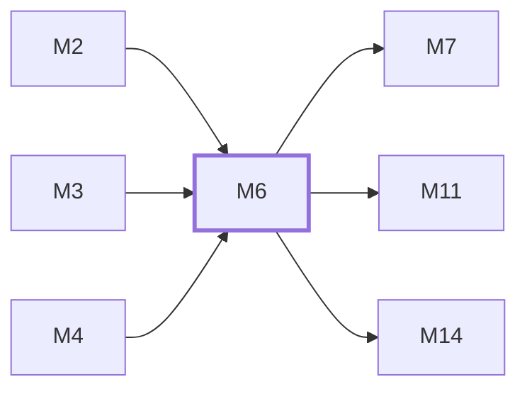

# M6　用量、订阅与支付：UsageLog、余额/订阅窗口、计价、订单、provider webhook、履约和退款

## 依赖关系

- 本模块依赖：[[M2]]、[[M3]]、[[M4]]
- 被依赖：[[M7]]、[[M11]]、[[M14]]

## 下辖任务（2 个 · 4.5 人天）

| 任务 | 标题 | 预估 | 覆盖边界 |
|---|---|---|---|
| [[M6-T1]] | 维护用量、计价与订阅窗口 | 2d | [[E-17]] |
| [[M6-T2]] | 维护支付订单、履约与退款 | 2.5d | [[E-18]]、[[E-19]] |

## 涉及的边界

- [[E-17]]　必须落账的 usage 事件拥塞
- [[E-18]]　支付通知伪造、重复、乱序或迟到
- [[E-19]]　退款远端与本地状态分裂

## 代码位置

<!-- code:begin -->
- `backend/internal/service/usage_billing.go` — 用量计价与扣费
- `backend/internal/service/usage_record_worker_pool.go` — Usage 记录 worker 与背压
- `backend/internal/service/subscription_service.go` — 订阅窗口与限额
- `backend/internal/service/payment_order_lifecycle.go` — 订单状态转换
- `backend/internal/service/payment_refund.go` — 退款补偿与审计
- `backend/internal/payment/` — 支付 provider 抽象、注册表、金额/费率与负载均衡
- `backend/internal/service/billing_service.go` — 计费缓存/上下文/令牌成本服务族
- `backend/internal/service/pricing_service.go` — 模型定价服务
- `backend/internal/service/custom_channel_time_pricing.go` — 自定义分时定价与分组用量汇总族
- `backend/internal/service/balance_notify_service.go` — 余额通知
- `backend/internal/service/service_tier_billing.go` — 服务档位计费
- `backend/cmd/profit-preview/` — 利润预览 CLI（service 层 profit_preview 同族）
<!-- code:end -->

## 备注

<!-- notes:begin -->
UsageLog 是报表、计费和 Ops 共用事实，mandatory 事件不能在队列拥塞时静默丢失。支付以 provider 验签、数据库状态 guard 和审计日志组成幂等链；远端退款与本地权益分裂时保留 pending/failed，而不是伪装成功。
<!-- notes:end -->
