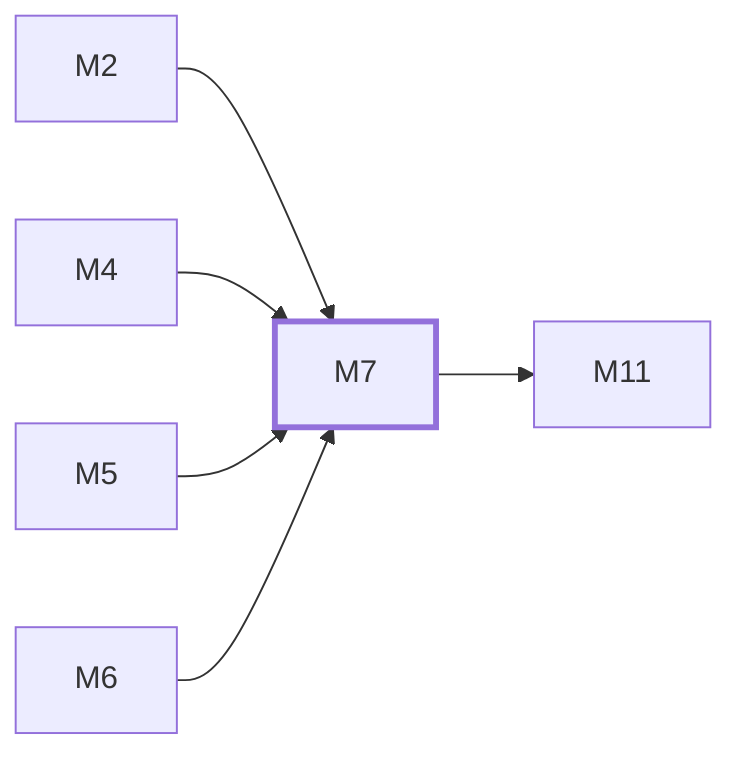

# M7　异步媒体与任务运行时：异步/批量图片、队列、worker、结算、恢复、输出存储与清理

## 依赖关系

- 本模块依赖：[[M2]]、[[M4]]、[[M5]]、[[M6]]
- 被依赖：[[M11]]

## 下辖任务（2 个 · 3.5 人天）

| 任务 | 标题 | 预估 | 覆盖边界 |
|---|---|---|---|
| [[M7-T1]] | 维护异步与批量图片队列 | 2d | [[E-20]]、[[E-21]] |
| [[M7-T2]] | 维护输出存储、下载与清理 | 1.5d | [[E-22]] |

## 涉及的边界

- [[E-20]]　Worker 崩溃留下活跃任务或 billing hold
- [[E-21]]　批量任务重复提交
- [[E-22]]　异步输出越权、过期或已删除

## 代码位置

<!-- code:begin -->
- `backend/internal/handler/batch_image_handler.go` — 批量图片 HTTP 边界
- `backend/internal/service/batch_image_worker_runtime.go` — worker、延迟搬运和恢复 runtime
- `backend/internal/service/batch_image_billing_recovery.go` — billing hold 回收
- `backend/internal/service/batch_image_download.go` — 输出授权下载
- `backend/internal/repository/batch_image_repo.go` — Job/Item/Event 持久化
<!-- code:end -->

## 备注

<!-- notes:begin -->
队列投递、provider 执行和结算跨进程边界，所有恢复动作都必须幂等。Job 状态和 billing hold 共同决定是否可重试；输出对象的删除不能先于所有权、账务和必要审计判定。
<!-- notes:end -->
