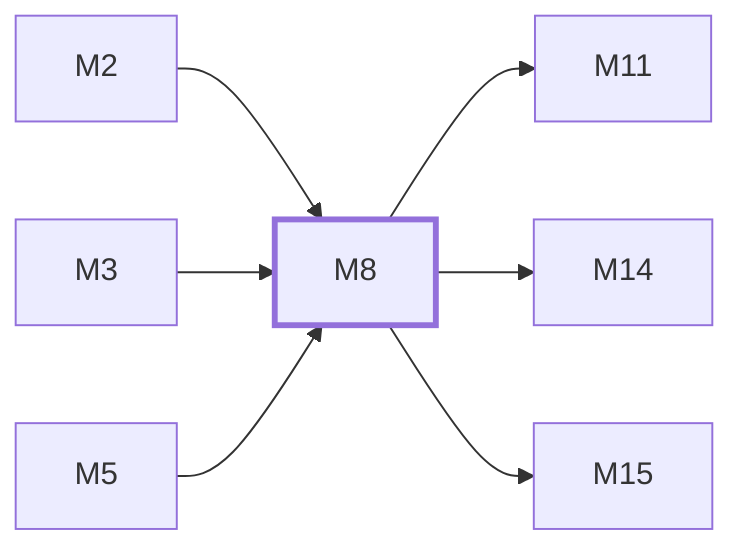

# M8　观测、频道监控与 Prompt Audit：Ops 指标/日志/告警、监控 runner、内容安全策略与审计事件

## 依赖关系

- 本模块依赖：[[M2]]、[[M3]]、[[M5]]
- 被依赖：[[M11]]、[[M14]]、[[M15]]

## 下辖任务（2 个 · 4 人天）

| 任务 | 标题 | 预估 | 覆盖边界 |
|---|---|---|---|
| [[M8-T1]] | 维护 Ops、频道监控与告警 | 2d | [[E-23]] |
| [[M8-T2]] | 维护 Prompt Audit 与安全策略 | 2d | [[E-24]] |

## 涉及的边界

- [[E-23]]　Ops/监控链路不可用
- [[E-24]]　Prompt Audit 启动或扫描不可用

## 代码位置

<!-- code:begin -->
- `backend/internal/service/ops_service.go` — Ops 服务入口
- `backend/internal/service/channel_monitor_runner.go` — 频道监控调度
- `backend/internal/repository/ops_repo.go` — Ops 查询与聚合存储
- `backend/internal/securityaudit/` — Prompt Audit 策略、worker 和存储
- `frontend/src/features/prompt-audit/` — Prompt Audit 管理界面
- `backend/internal/service/content_moderation.go` — 内容风控/关键词/脱敏服务族
- `backend/internal/service/audit_log_service.go` — 操作审计服务族
- `backend/internal/handler/admin/content_moderation_handler.go` — 风控与审计管理端点
- `frontend/src/features/channel-monitor-v2/` — 频道监控 V2 前端功能面
- `backend/scripts/finalize-ingress-reject-cleanup.sql` — ingress 拒绝日志收尾 SQL
- `backend/cmd/cleanup-ingress-reject-logs/` — 拒绝日志清理命令
<!-- code:end -->

## 备注

<!-- notes:begin -->
普通观测故障应降级而不改写网关业务结果；明确的阻断安全策略是例外。Prompt Audit 启动失败是否 fail-closed 取决于是否已经观察到持久化 blocking 意图，不能把所有初始化失败都当成全站阻断。
<!-- notes:end -->
