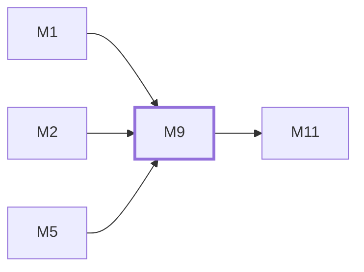

# M9　插件与扩展：manifest/gRPC 契约、包安装、兼容检查、进程 reconcile、灰度路由和 UI bridge

## 依赖关系

- 本模块依赖：[[M1]]、[[M2]]、[[M5]]
- 被依赖：[[M11]]

## 下辖任务（2 个 · 3.5 人天）

| 任务 | 标题 | 预估 | 覆盖边界 |
|---|---|---|---|
| [[M9-T1]] | 维护插件契约、包与兼容检查 | 1.5d | [[E-25]] |
| [[M9-T2]] | 维护插件 runtime、reconcile 与路由 | 2d | [[E-26]] |

## 涉及的边界

- [[E-25]]　插件包不兼容或路径不安全
- [[E-26]]　插件权威状态不可读或 runtime 不健康

## 代码位置

<!-- code:begin -->
- `backend/pkg/pluginapi/v1/plugin.proto` — host/plugin gRPC 契约
- `backend/pkg/pluginapi/v1/manifest.schema.json` — manifest schema
- `backend/internal/service/plugin_package.go` — 插件包安装与路径校验
- `backend/internal/service/plugin_manager.go` — DB 权威 reconcile 与路由发布
- `backend/internal/service/plugin_runtime.go` — 子进程生命周期和健康检查
- `backend/pkg/pluginapi/docs/` — 插件开发、包格式、安全与 UI bridge 文档
- `backend/pkg/pluginapi/v1/plugin.pb.go` — proto 生成代码与 gRPC stub（随 proto 再生成）
- `backend/pkg/pluginapi/v1/runtime.go` — host 侧 gRPC runtime 接口
<!-- code:end -->

## 备注

<!-- notes:begin -->
数据库绑定是插件启用状态的权威来源，每个实例独立 reconcile。状态不可读或 runtime 不健康时发布 unavailable route，禁止静默回落到绕过插件的直连；切换 runtime 时先发布一致状态再 drain 旧进程。
<!-- notes:end -->
